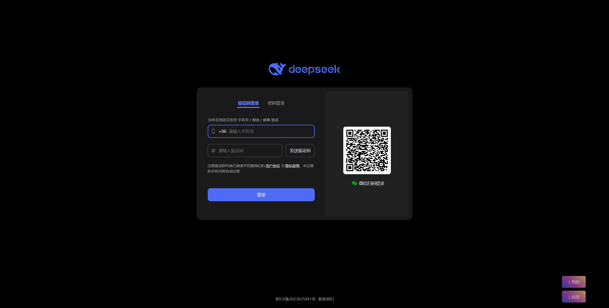

# Cat-Script

## 项目简介
Cat-Script 是一个浏览器用户脚本集合，旨在提升网页浏览体验。目前包含一个滚动控制脚本，可以帮助用户快速滚动到网页顶部或底部。

## 功能特性
### 滚动到顶部和底部脚本 (scroll.user.js)
- 在网页右下角添加两个悬浮按钮，用于快速滚动到页面顶部或底部
- 自动处理懒加载内容，确保滚动到真正的页面底部
- 支持按钮拖拽，可自定义位置
- 半透明设计，鼠标悬停时完全显示
- 美观的渐变按钮样式

## 演示效果

## 安装方法
1. 首先安装一个用户脚本管理器，推荐使用：
   - [Tampermonkey](https://www.tampermonkey.net/) (Chrome, Firefox, Edge, Safari)
   - [Violentmonkey](https://violentmonkey.github.io/) (Chrome, Firefox)
   - [Greasemonkey](https://addons.mozilla.org/en-US/firefox/addon/greasemonkey/) (Firefox)

2. 安装脚本：
   - 方法一：从GitHub安装
     - 访问 [https://github.com/bzw1204/cat-script](https://github.com/bzw1204/cat-script)
     - 点击需要的脚本文件（如`scroll.user.js`）
     - 点击"Raw"按钮，脚本管理器会自动提示安装

   - 方法二：直接复制安装
     - 打开脚本管理器的控制面板
     - 创建新脚本
     - 复制`scroll.user.js`的内容并粘贴
     - 保存

## 使用方法
安装后，访问任何网站时会在右下角显示两个按钮：
- "↑ 顶部" - 点击滚动到页面顶部
- "↓ 底部" - 点击滚动到页面底部

按钮支持拖拽以调整位置，使用起来十分方便。

## 贡献
欢迎提交问题反馈和功能请求！您可以通过以下方式参与：
- 提交Issue
- 提交Pull Request

## 许可证
此项目使用开源许可证发布。

## 作者
baizw

---
GitHub: [https://github.com/bzw1204/cat-script](https://github.com/bzw1204/cat-script)